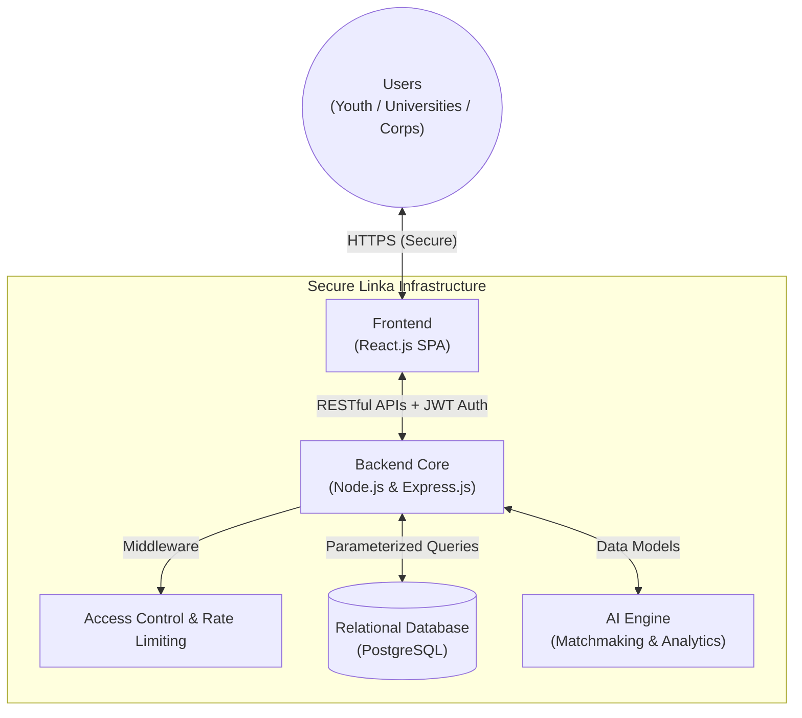

# PROJECT PROPOSAL: LINKA
**The Smart National Ecosystem for Volunteering & Interactive Placement**

**Submitted To:** Palestine Cybersecurity & AI Conference 2026

## 1. PROJECT OVERVIEW & EXECUTIVE SUMMARY

### 1.1 Project Information
* **Project Name:** Linka
* **Target Track:** Artificial Intelligence and the Building of the Palestinian State (Focus: Innovation in Secure Digital Services)
* **Project Supervisor:** Dr. Hani Salah
* **Linka Core Team:** 
  * Qais Amro (qaisamro454@gmail.com)
  * Hanaa Maswadi (physicisthana2003@gmail.com)
  * Bashar Wazwaz (Basharwazwaz@gmail.com)

### 1.2 Executive Summary
In alignment with the conference's vision to achieve "Secure Digital Sustainability," the **Linka** project emerges as an innovative, strategic solution bridging the profound gap between the volunteering passion of Palestinian youth and their ability to demonstrate tangible competencies in the local job market. Linka provides a centralized, highly secure digital ecosystem that intelligently connects youth capabilities with community and professional opportunities.

Operating on a robust, state-of-the-art technological architecture, Linka accurately tracks, records, and evaluates field skills, subsequently generating reliable, immutable digital Capability Records (Digital CVs). By integrating Artificial Intelligence (AI) algorithms with advanced Cybersecurity protocols, Linka transcends the traditional scope of an interactive job portal. It represents foundational national infrastructure designed to empower youth, entirely harmonizing with the conference's vision to employ advanced technology toward sustainable, sovereign institutional development in Palestine.

---

## 2. PROBLEM ANALYSIS AND OBJECTIVES (THE WHY)

### 2.1 Problem Analysis
The current volunteering and human resources landscape for young talents in Palestine suffers from fundamental challenges:
* **Absence of Centralized, Secure Ecosystems:** There is a critical lack of sovereign, secure national platforms capable of reliably authenticating skills and institutional efforts.
* **Loss of Measurable Impact:** Countless hours of training and volunteering dissipate without quantifiable or digitally verifiable records.
* **Data Security & Privacy Vulnerabilities:** The reliance on unencrypted, unstructured public platforms for informal employment sourcing poses severe cybersecurity threats, rendering user data susceptible to breaches and unauthorized exploitation.

### 2.2 The Innovative Solution
**Linka** introduces an independent digital ecosystem that surpasses standard job boards. It functions as an advanced evaluation and tracking engine, seamlessly connecting universities, enterprises, and youth within a rigorously secure technical environment. The platform offers real-time tracking and geographical validation of events. These participations are converted into encrypted, tamper-proof digital records, ensuring absolute data security and enabling enterprises to actively recruit verified talent driven by analyzed, trustworthy metrics.

### 2.3 SMART Goals
1. **Specific:** Design and deploy a comprehensive web platform featuring distinct portals for youth, universities, and corporations, establishing an innovative, secure national reference for activity verification.
2. **Measurable:** Implement 100% cryptographic encryption for all sensitive user data and ensure zero-vulnerability data persistence.
3. **Achievable:** Establish a formidable security architecture by securing Application Programming Interfaces (APIs) and state management utilizing globally recognized standards within a 6-month timeframe.
4. **Relevant:** Enhance the quality of digital services and electronically secure Palestinian human resource data, directly contributing to the conference's theme of "Secure Digital Sustainability."
5. **Time-bound:** Execute advanced penetration testing and present a fully operational, live-tested platform by May 2026.

---

## 3. TECHNICAL ARCHITECTURE & SECURITY (THE HOW)

As a specialized Full-Stack Development Team, we engineered Linka's infrastructure to be exceptionally adaptable, scalable, and secure, utilizing cutting-edge decoupling technologies representative of the current live production environment.

### 3.1 System Architecture
Linka is built upon a modernized Client-Server architecture, ensuring rigid separation of concerns. The following diagram illustrates the high-level data flow and component decoupling within the platform:

* **Frontend (Client-Side):** Developed using **React.js**, delivering a responsive, dynamic User Experience (UX). It leverages robust state management to orchestrate rapid, secure data flow without triggering full-page reloads, drastically minimizing client-side vulnerabilities.
* **Backend (Server-Side):** Anchored by a high-performance **Node.js** and **Express.js** environment. This asynchronous architecture guarantees extremely rapid response times and handles intensive I/O operations seamlessly. It is supported by a powerful **PostgreSQL** database, ensuring complex record processing operates with maximum efficiency and strict ACID compliance.
* **Data Transport & Integration:** Inter-system communication strictly adheres to meticulously orchestrated **RESTful APIs**, ensuring precise data flow management and compartmentalization of database privileges.

### 3.2 Cybersecurity Standards
Maintaining uncompromised security is the paramount priority for the Linka network:
* **Data Encryption:** Enforces rigorous password security using advanced salt-and-hash algorithms (Bcrypt), alongside robust encryption for all in-transit communications and sensitive payloads.
* **API Security:** All RESTful API endpoints are encapsulated by Middleware Access Control mechanisms, definitively preventing unauthorized intrusion. Aggressive Rate Limiting is active to neutralize Brute Force attempts.
* **Session Protection:** Session management exclusively dictates the transmission of JSON Web Tokens (JWT) through strictly hidden `HttpOnly` Cookies. This entirely nullifies Cross-Site Scripting (XSS) and Cross-Site Request Forgery (CSRF) attack vectors.
* **Database Fortification:** Unwavering utilization of Parameterized Queries guarantees absolute immunity against SQL Injection vulnerabilities within the PostgreSQL ecosystem.

### 3.3 Artificial Intelligence (AI) Integration
Linka deploys embedded AI mechanisms to elevate system capabilities:
* **AI Matchmaking:** Extensively analyzes historical activities and acquired proficiencies to deliver hyper-personalized recommendations for students (field-appropriate training) and corporations (proactively suggested, verified candidates).
* **Security Analytics:** Evaluates platform utilization patterns via algorithmic anomaly detection, establishing an autonomous security-awareness layer capable of identifying and intercepting aberrant behaviors.

---

## 4. SCALABILITY AND IMPACT (THE IMPACT)

### 4.1 Scalability
Linka’s architectural blueprint is purposefully designed to accommodate expansive horizontal and vertical scaling:
* **Broad Institutional Scaling:** Through the persistent API-driven Node.js architecture, the platform facilitates future Enterprise Resource Planning (ERP) integrations with university systems and the rapid deployment of native Mobile Applications with minimal developmental overhead.
* **Community Service Expansion:** The system is inherently replicable for public sector deployments, forming the foundation for a comprehensive national talent-tracking registry based on demonstrable performance rather than mere academic credentials across all Palestinian governorates.

### 4.2 Strategic Roadmap (Leading to May 2026)
As the platform has already concluded its primary development lifecycle and is currently successfully **Deployed and Live** on production servers, the forthcoming strategic phases focus on stringent security auditing and widespread adoption:
* **Phase 1 (AI Algorithm Refinement):** Expanding AI Matchmaking dimensions parameterized by genuine, reliable datasets accumulated from live user traffic currently interacting with the platform.
* **Phase 2 (Security Auditing & Penetration Testing):** Conducting rigorous Advanced Pentesting regimens directly on the live production server environment to identify anomalous vulnerabilities and guarantee operational stability against real-world threat actors.
* **Phase 3 (Load Testing & Adoption Expansion):** Initiating deliberate Stress Analysis and Load Balancing operations to mathematically confirm the server's capacity during peak ingestion, coupled with the aggressive onboarding of actual corporate and academic entities.
* **May 2026 (Conference Finale):** The official, expanded launch and exhibition of the system—not as a prototype, but as a **Fully Scalable & Validated Product**—nationally inaugurated before the esteemed committees of the Palestine Cybersecurity & AI Conference 2026.

---

## 5. CONCLUSION & REFERENCES

### 5.1 Conclusion
The **Linka** project defines a new paradigm for innovative student initiatives, transcending academic theory to provide a radical, highly applicable real-world solution. By deploying React.js and Node.js/PostgreSQL within a highly flexible, secure architecture compliant with global cybersecurity standards, and by pioneering the integration of AI-driven business intelligence, this project establishes a functional cornerstone for "Secure Digital Sustainability." The Linka core team demonstrates a profound capability to deliver a sovereign national platform serving Palestinian youth, acting as a technological building block that bolsters the resilient, modern development of the Palestinian digital state.

### 5.2 Technical & Scientific References
1. **OWASP Foundation** (2025). *OWASP Top 10 Application Security Risks*. Comprehensive Guidelines for securing modern web systems.
2. **Node.js Security Architecture** (2025). *Best Practices for Secure Express.js Backend Development, Connection Pooling, and API Security*. Node.js Official Documentation.
3. **React Community** (2025). *Advanced State Management, Component Lifecycle, and Interactive Web App Security*.
4. **Alpaydin, E.** (2024). *Introduction to Machine Learning*. MIT Press. (Foundational reference for implementing intelligent matchmaking models).
5. **NIST (National Institute of Standards and Technology)** (2024). *Framework for Improving Critical Infrastructure Cybersecurity*. Standard models for securing digital infrastructures at enterprise scale.
